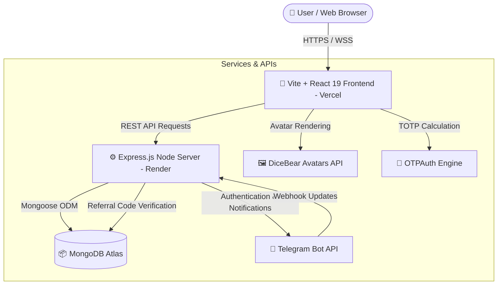

<div align="center">

  <!-- Typing Effect Banner -->
  <a href="https://git.io/typing-svg">
    
  </a>

  <p align="center">
    <strong>⚡ An All-in-One Social Account Intelligence, Profile Generation & 2FA Suite ⚡</strong>
  </p>

  <p align="center">
    A high-performance modern web application built with <strong>React 19</strong>, <strong>TypeScript</strong>, <strong>Vite</strong>, <strong>Node.js/Express</strong>, <strong>MongoDB</strong>, and <strong>Telegram Bot Integration</strong>.
  </p>

  <!-- Shields & Badges -->
  <p align="center">
    <a href="https://profilenexus.vercel.app">
      
    </a>
    <a href="https://render.com">
      
    </a>
    <a href="https://react.dev">
      
    </a>
    <a href="https://www.typescriptlang.org/">
      
    </a>
    <a href="https://vitejs.dev/">
      
    </a>
    <a href="https://tailwindcss.com">
      
    </a>
    <a href="https://www.mongodb.com">
      
    </a>
    <a href="https://core.telegram.org/bots/api">
      
    </a>
    <a href="#license">
      
    </a>
  </p>

  <!-- Quick Links Navigation -->
  <p align="center">
    <a href="#-key-features">Key Features</a> •
    <a href="#-ui-screenshots">Screenshots</a> •
    <a href="#-tech-stack">Tech Stack</a> •
    <a href="#-architecture">Architecture</a> •
    <a href="#-getting-started">Getting Started</a> •
    <a href="#-deployment">Deployment</a> •
    <a href="#-license">License</a>
  </p>

</div>

---

## 📖 Overview

**ProfileNexus** is a production-grade identity generation and social account analytics suite designed for digital marketers, security researchers, and developers. Featuring a stunning glassmorphic UI, ProfileNexus combines realistic identity synthesis, live 2FA TOTP token creation, instant Facebook & Instagram handle/UID status verifications, IP intelligence, and a dynamic Telegram credit economy.

> [!NOTE]
> **Live Demo App:** [profilenexus.vercel.app](https://profilenexus.vercel.app)  
> **Telegram Bot:** [@ProfileNexus_bot](https://t.me/ProfileNexus_bot)

---

## ✨ Key Features

| Icon | Feature Module | Description |
| :---: | :--- | :--- |
| 🛡️ | **2FA.Live Authenticator** | Generate 6-digit TOTP authentication codes in real time from secret keys with a live 30s refresh timer. |
| 👤 | **Synthetic Profile Generator** | Instantly create full identity profiles (names, DOB, age, email, credentials, address, and custom tags like `Prime@01`). |
| 📘 | **Facebook Live UID Checker** | Bulk scan Facebook UIDs and links to distinguish **Active (Live)** vs **Disabled (Dead)** accounts. |
| 📷 | **Instagram Live UID Checker** | Bulk verify Instagram handles and UIDs with real-time active/disabled account sorting. |
| 🔗 | **Facebook UID Extractor** | Extract numeric Facebook User IDs directly from profile links, vanity usernames, and group URLs. |
| 🌐 | **IP Geolocation & Security** | Perform instant IP checks, inspect location data, proxy/VPN flags, and network security statuses. |
| 💰 | **Telegram Referral & Credit Engine** | Seamless Telegram WebApp / Bot login, initial credit allocations, and **+500 Credits** per Telegram referral. |
| 📊 | **Admin & Tool Analytics** | Dashboard metrics powered by **Recharts**, tool latency logs, maintenance toggles, and user management. |

---

## 🖼️ UI Screenshots

<div align="center">

### 🔐 2FA.Live Authenticator & Live TOTP Engine
*Generate instant 6-digit 2FA codes with auto-refresh progress bar*


---

### 📘 Facebook Account Verification & Extraction

<table>
  <tr>
    <td width="50%" align="center">
      <strong>Check Live Facebook UID</strong><br/><br/>
      
    </td>
    <td width="50%" align="center">
      <strong>Get UID from Facebook Link</strong><br/><br/>
      
    </td>
  </tr>
</table>

---

### 📷 Instagram Live Account Scanner
*Bulk verify Instagram usernames and UIDs for Active vs Disabled status*


</div>

---

## 🛠️ Tech Stack

```
 🎨 FRONTEND                            ⚙️ BACKEND                             📦 DATABASE & STORAGE
 ├── React 19                           ├── Node.js (v18+)                     ├── MongoDB Atlas
 ├── TypeScript 5.8                     ├── Express.js                         └── Mongoose 9 ODM
 ├── Vite 6                             ├── TSX Runner
 ├── Tailwind CSS v4                    ├── Crypto (HMAC-SHA-256)               🤖 BOT & SECURITY
 ├── Motion (Framer Motion)             └── OTPAuth (RFC 6238 TOTP)            ├── Telegram Bot API
 ├── Recharts (Analytics)                                                      └── JWT Auth
 └── Lucide React Icons
```

---

## 🏗️ Architecture & Data Flow



---

## 🚀 Getting Started

Follow these steps to set up ProfileNexus locally on your machine.

### Prerequisites
* **Node.js**: `v18.0.0` or higher
* **npm** or **bun** / **yarn**
* **MongoDB**: A running local instance or MongoDB Atlas Connection String
* **Telegram Bot Token**: Created via [@BotFather](https://t.me/BotFather) (Optional for local testing)

---

### 1. Clone the Repository

```bash
git clone https://github.com/your-username/profilenexus.git
cd profilenexus
```

### 2. Install Dependencies

```bash
npm install
```

### 3. Environment Configuration

Create a `.env` file in the root directory by copying `.env.example`:

```bash
cp .env.example .env
```

Add your environment variables:

```env
# Server Configuration
PORT=5000
NODE_ENV=development

# Database Configuration
MONGODB_URI=mongodb+srv://<db_user>:<db_password>@cluster0.mongodb.net/profilenexus

# Security & Authentication
JWT_SECRET=your_super_secret_jwt_key_change_me

# Telegram Bot Integration
TELEGRAM_BOT_TOKEN=123456789:ABCdefGHIjklMNOpqrsTUVwxyZ
TELEGRAM_BOT_USERNAME=ProfileNexus_bot

# URLs
FRONTEND_URL=http://localhost:5173
VITE_API_URL=http://localhost:5000
```

---

### 4. Run Development Environment

Start the **Node.js Express Backend**:

```bash
npm start
```
> The API server will start on `http://localhost:5000`

In a separate terminal, start the **Vite + React Frontend**:

```bash
npm run dev
```
> Open `http://localhost:5173` in your browser.

---

## 🌐 Deployment

ProfileNexus is configured for continuous integration and seamless deployment:

### ⚡ Frontend (Vercel)
The client application is configured for Vercel with automatic single-page app routing defined in [`vercel.json`](file:///d:/fake-name-generator/vercel.json):
* **Framework Preset**: Vite
* **Build Command**: `npm run build`
* **Output Directory**: `dist`

### 🛡️ Backend API & Webhook (Render)
The backend service operates on Render using the [`render.yaml`](file:///d:/fake-name-generator/render.yaml) specification:
* **Environment**: Node
* **Build Command**: `npm install`
* **Start Command**: `npm start`
* **Port**: `5000`

---

## 📜 License

Distributed under the **MIT License**. See [`LICENSE`](LICENSE) for more information.

---

<div align="center">
  <sub>Built with ❤️ by the ProfileNexus Team</sub>
</div>
